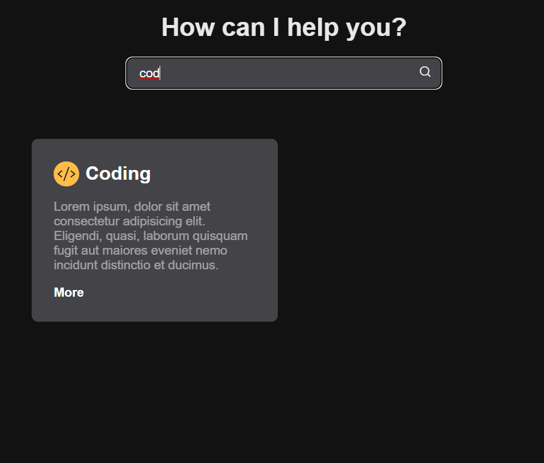

# 💻 Filter Form

The purpose of this project is to build an interface that can filter the information that the user wants to see by text input.
The information is organized by cards. For testing purposes, I only created four cards.
I used a form to receive the input to filter and the filter was applied directly to the titles of each card. This filter was applied using JS DOM manipulation.




# 📱 Responsive Design
The page respects the responsive design.


# 🛠️​ Technologies

This project was developed with the following technologies:

- [HTML](https://developer.mozilla.org/en-US/docs/Web/HTML)
- [CSS](https://developer.mozilla.org/en-US/docs/Web/CSS)
- [JavaScript](https://developer.mozilla.org/en-US/docs/Web/JavaScript)

📚Libraries:

- [Phosphor Icons](https://phosphoricons.com/)

# ⚙️Setup

## Run locally

Create and go to the directory where you want to place the repository

```bash
    cd directory
```

Clone the project

```bash
  git clone https://github.com/ma-oliveiramarques/filter-form.git

```

Go to the project directory

```bash
  cd filter-form
```

Open in Visual Studio Code

```bash
  code .
```

# 📝​ License

MIT